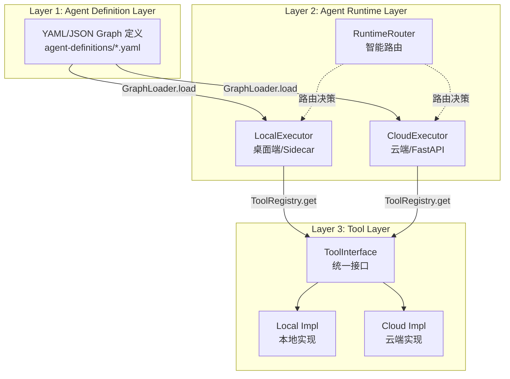
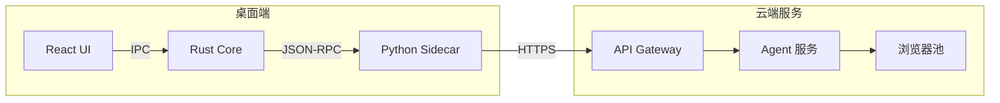
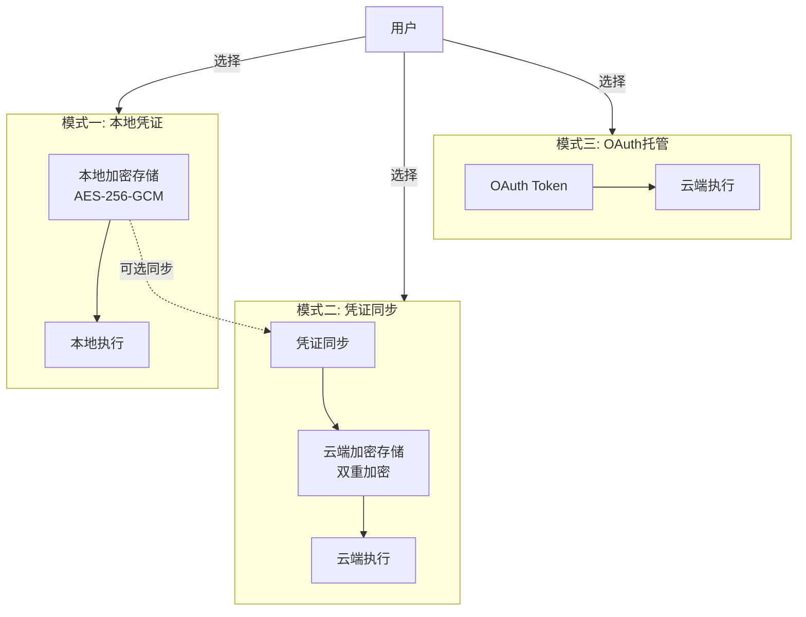

# AI Creator - AI 上下文文档

> **模型**: Claude Opus 4.5 (claude-opus-4-5-20251101)
> **生成时间**: 2026-01-06
> **作者**: @Ysf

---

## 📋 项目概览

**AI Creator** - 自媒体一体化AI客户端，从灵感到变现的全链路AI助手

### 核心定位

成为每一位创作者的 AI 超级大脑，通过深度集成 AI Agent 能力，实现内容创作、管理、发布、运营的全流程自动化。

### 技术架构

采用 **Monorepo + Git Submodule** 混合架构：
- **Monorepo 管理**: 核心共享包 (agent-core)、桌面端 (Tauri)、Sidecar (Python)、移动端 (uni-app)
- **Git Submodule**: 独立服务 (云端后端/前端、LLM网关、舆情分析)

### 核心技术栈

| 层级 | 技术选型 | 说明 |
|------|---------|------|
| **桌面端** | Tauri 2.0 + React + Rust | 原生性能，内嵌 Python Sidecar |
| **移动端** | uni-app (TypeScript) + unibest | 一套代码发布 iOS/Android/小程序 |
| **云端后端** | FastAPI + SQLAlchemy + Celery | fastapi_best_architecture 框架 |
| **云端前端** | Vue 3 + Vben Admin | 企业级管理后台 |
| **Agent 核心** | LangGraph + Claude API | 端云统一的 Agent Runtime |
| **LLM 网关** | new-api (Go) | 多供应商统一接口 |
| **舆情分析** | BettaFish + MindSpider | 热点追踪 + 数据采集 |

---

## 🏗️ 架构总览

### Monorepo 目录结构

```
ai-creator/                              # Monorepo 根目录
├── pyproject.toml                       # Python Workspace (uv)
├── pnpm-workspace.yaml                  # Node.js Workspace (pnpm)
├── uv.lock                              # Python 依赖锁定
├── .gitmodules                          # Git Submodule 配置
│
├── packages/                            # 共享包 (Monorepo 管理)
│   └── agent-core/                      # Python: Agent 核心库
│       ├── src/agent_core/
│       │   ├── runtime/                 # 执行器 + 路由器
│       │   ├── graph/                   # Graph 加载/编译
│       │   ├── tools/                   # 工具层基类
│       │   ├── llm/                     # LLM 统一接口
│       │   ├── platforms/               # 平台适配器
│       │   ├── resource/                # 资源管理
│       │   └── crypto/                  # 加密工具
│       └── tests/                       # 单元测试
│
├── apps/                                # 应用层 (Monorepo 管理)
│   ├── desktop/                         # Tauri: 桌面端应用
│   │   ├── src/                         # React 前端
│   │   │   ├── components/              # UI 组件
│   │   │   ├── routes/                  # 路由页面
│   │   │   ├── hooks/                   # React Hooks
│   │   │   └── stores/                  # Zustand 状态管理
│   │   └── src-tauri/                   # Rust 后端
│   │       ├── src/                     # Rust 核心
│   │       └── sidecar/                 # Sidecar 二进制
│   │
│   ├── sidecar/                         # Python: 桌面端 Sidecar 服务
│   │   └── src/sidecar/
│   │       ├── main.py                  # JSON-RPC 服务入口
│   │       ├── executor.py              # LocalExecutor
│   │       ├── tools/                   # 本地工具实现
│   │       ├── services/                # 本地服务
│   │       ├── browser/                 # browser-use AI 浏览器
│   │       └── scheduler/               # 定时任务
│   │
│   ├── mobile-app/                      # uni-app: 移动端应用 (基于 unibest)
│   │   ├── src/                         # 源码目录
│   │   │   ├── pages/                   # 页面
│   │   │   ├── components/              # 组件
│   │   │   └── stores/                  # 状态管理
│   │   └── package.json                 # 依赖配置
│   │
│   └── landing/                         # 静态: 落地页
│
├── services/                            # 独立服务 (Git Submodule)
│   ├── cloud-backend/                   # FastAPI: 云端后端服务
│   │   └── backend/
│   │       ├── app/
│   │       │   ├── api/                 # API 路由
│   │       │   ├── agent/               # Agent 执行
│   │       │   ├── credential/          # 凭证同步
│   │       │   ├── services/            # 业务服务
│   │       │   └── models/              # 数据模型
│   │       └── plugin/                  # 插件系统
│   │
│   ├── cloud-frontend/                  # Vue: 云端管理后台
│   │   ├── apps/web-antd/               # Ant Design 版本
│   │   └── packages/                    # 共享包
│   │
│   └── new-api/                         # Go: LLM API 网关
│       ├── web/                         # 管理界面
│       └── controller/                  # 控制器
│
├── external/                            # 外部项目 (Git Submodule)
│   ├── BettaFish/                       # 舆情分析系统
│   │   ├── ReportEngine/                # 报告引擎
│   │   ├── SentimentAnalysisModel/      # 情感分析模型
│   │   └── MindSpider/                  # 数据采集
│   │
│   └── MiroFish/                        # 数据采集系统
│       ├── backend/                     # 后端服务
│       └── frontend/                    # 前端界面
│
├── agent-definitions/                   # Graph 定义（共享）
│   ├── content-creation.yaml            # 内容创作 Graph
│   ├── publish-workflow.yaml            # 发布工作流 Graph
│   ├── viral-content.yaml               # 爆款内容 Graph
│   └── analytics.yaml                   # 数据分析 Graph
│
├── docs/                                # 项目文档
│   ├── 00-品牌愿景.md
│   ├── 01-系统架构.md
│   ├── 02-桌面端设计.md
│   ├── 03-移动端设计.md
│   ├── 04-云端服务设计.md
│   ├── 05-Agent-Runtime.md
│   ├── 06-平台适配器.md
│   ├── 07-AI工作流.md
│   ├── 08-数据模型.md
│   ├── 09-商业模式.md
│   ├── 10-约束细则.md
│   ├── 11-开发规范.md
│   ├── 12-设计规格.md
│   ├── 13-需求规格.md
│   ├── 14-补充需求规格.md
│   └── 15-桌面端开发计划.md
│
└── .specstory/                          # 开发记录
    └── history/docs/
        └── session.md                   # 会话记录
```

---

## 🎯 核心模块索引

### 1. Agent Core (packages/agent-core/)

**定位**: 端云统一的 Agent Runtime 抽象层

**核心组件**:
- `runtime/` - 执行器接口、智能路由器、运行时上下文
- `graph/` - Graph 加载器、编译器、验证器
- `tools/` - 工具接口、工具注册表、内置工具
- `llm/` - LLM 统一接口、云端客户端、直接调用客户端
- `platforms/` - 平台适配器（小红书、抖音、B站、微博、微信公众号）
- `resource/` - 资源管理、URI 解析
- `crypto/` - 加密工具、凭证加密

**依赖关系**:
```
agent-core (无外部依赖)
    ↑
    ├── apps/sidecar (依赖 agent-core)
    └── services/cloud-backend (依赖 agent-core)
```

**关键文件**:
- `__init__.py` - 模块导出
- `runtime/interfaces.py` - 核心接口定义
- `runtime/router.py` - 智能路由器
- `llm/config.py` - LLM 配置管理
- `llm/cloud_client.py` - 桌面端 LLM 客户端
- `llm/direct_client.py` - 云端 LLM 客户端

**导航**: [详细文档](./packages/agent-core/CLAUDE.md)

---

### 2. Desktop App (apps/desktop/)

**定位**: Tauri 2.0 桌面端应用

**技术栈**:
- 前端: React 19 + TanStack Router + TanStack Query + Zustand
- 后端: Rust + Tauri 2.0
- 编辑器: TipTap (富文本编辑器)
- UI: Tailwind CSS + shadcn/ui

**核心功能**:
- 创作工作台 (AI 辅助写作)
- 发布中心 (多平台发布)
- 数据看板 (运营数据)
- 设置中心 (LLM 配置、凭证管理)

**关键文件**:
- `src/main.tsx` - 应用入口
- `src/routes/` - 路由页面
- `src/components/` - UI 组件
- `src/hooks/useSidecar.ts` - Sidecar 通信 Hook
- `src-tauri/src/lib.rs` - Rust 主入口
- `src-tauri/src/sidecar/mod.rs` - Sidecar 管理器

**导航**: [详细文档](./apps/desktop/CLAUDE.md)

---

### 3. Sidecar (apps/sidecar/)

**定位**: 桌面端 Python Sidecar 服务

**核心功能**:
- JSON-RPC 服务 (与 Tauri 通信)
- LocalExecutor (本地 Graph 执行)
- browser-use AI 浏览器操作 (无需选择器/流程脚本)
- 本地凭证加密存储
- 定时任务调度 (APScheduler)

**关键文件**:
- `src/sidecar/main.py` - JSON-RPC 服务入口
- `src/sidecar/executor.py` - LocalExecutor
- `src/sidecar/tools/browser.py` - 本地浏览器工具
- `src/sidecar/tools/credential.py` - 本地凭证工具
- `src/sidecar/services/credential_sync.py` - 凭证同步客户端
- `src/sidecar/browser/manager.py` - 浏览器管理器
- `src/sidecar/scheduler/publish_scheduler.py` - 发布调度器

**导航**: [详细文档](./apps/sidecar/CLAUDE.md)

---

### 4. Cloud Backend (services/cloud-backend/)

**定位**: FastAPI 云端后端服务

**技术栈**:
- 框架: FastAPI + SQLAlchemy 2.0 + Pydantic v2
- 数据库: PostgreSQL + Redis
- 任务队列: Celery
- 存储: MinIO/S3
- 搜索: Meilisearch

**核心功能**:
- Agent 执行服务 (CloudExecutor)
- 凭证同步服务
- 浏览器池管理
- LLM 网关集成
- 用户认证与授权
- 订阅与计费

**关键文件**:
- `backend/app/main.py` - FastAPI 应用入口
- `backend/app/agent/executor.py` - CloudExecutor
- `backend/app/agent/tools/browser.py` - 云端浏览器工具
- `backend/app/credential/` - 凭证同步模块
- `backend/app/services/browser_pool.py` - 浏览器池管理器

**导航**: [详细文档](./services/cloud-backend/CLAUDE.md)

---

### 5. Cloud Frontend (services/cloud-frontend/)

**定位**: Vue 3 云端管理后台

**技术栈**:
- 框架: Vue 3 + Vben Admin
- UI: Ant Design Vue
- 状态管理: Pinia
- 构建: Vite + Turbo

**核心功能**:
- 用户管理
- LLM 配置管理
- 模型组管理
- 用量统计
- 订阅管理

**导航**: [详细文档](./services/cloud-frontend/CLAUDE.md)

---

### 6. Mobile App (apps/mobile-app/)

**定位**: uni-app 移动端应用 (基于 unibest)

**技术栈**:
- 框架: uni-app + unibest
- 语言: Vue 3 + TypeScript
- 发布: iOS / Android / 微信小程序
- 管理: Monorepo (pnpm workspace)

**核心功能**:
- 快速记录 (灵感捕捉)
- 素材采集 (拍照、录音)
- 数据概览 (运营数据)
- 纯云端模式 (无本地 Agent)

**导航**: [详细文档](./apps/mobile-app/CLAUDE.md)

---

### 7. LLM Gateway (services/new-api/)

**定位**: Go 语言 LLM API 网关

**核心功能**:
- 多供应商统一接口 (OpenAI 兼容)
- 模型路由与负载均衡
- 速率限制与熔断
- 用量统计与计费
- API Key 管理

**导航**: [详细文档](./services/new-api/CLAUDE.md)

---

### 8. BettaFish (external/BettaFish/)

**定位**: 舆情分析系统

**核心功能**:
- 热点追踪
- 情感分析
- 报告生成
- 数据采集 (MindSpider)

**导航**: [详细文档](./external/BettaFish/CLAUDE.md)

---

## 🔧 全局规范

### 代码规范

**Python**:
- 格式化: `ruff format`
- Linter: `ruff check`
- 类型检查: `pyright` (strict mode)
- 命名: PascalCase (类), snake_case (函数), UPPER_SNAKE_CASE (常量)

**TypeScript/JavaScript**:
- 格式化: `prettier`
- Linter: `eslint`
- 类型检查: TypeScript strict mode
- 命名: PascalCase (组件), camelCase (函数/变量), UPPER_SNAKE_CASE (常量)

**Rust**:
- 格式化: `rustfmt`
- Linter: `clippy`
- 命名: PascalCase (类型), snake_case (函数/变量), SCREAMING_SNAKE_CASE (常量)

### Git 工作流

**分支策略**:
- `main` - 生产环境
- `develop` - 开发环境
- `feature/{ticket-id}-{description}` - 功能分支
- `fix/{ticket-id}-{description}` - 修复分支

**Commit 规范**:
```
<type>(<scope>): <subject>

类型:
- feat: 新功能
- fix: Bug 修复
- docs: 文档更新
- style: 代码格式
- refactor: 重构
- perf: 性能优化
- test: 测试相关
- chore: 构建/工具变更

示例:
feat(agent-core): add capability declaration for tools
fix(backend): resolve credential sync race condition
```

### 资源 URI 规范

**格式**: `asset://{runtime}/{type}/{id}`

**示例**:
- `asset://local/image/abc123` - 本地图片
- `asset://cloud/credential/xiaohongshu_user1` - 云端凭证
- `asset://local/temp/draft_001` - 本地临时文件

**禁止**:
- 硬编码绝对路径
- 使用相对路径
- 使用 `~` 或 `$HOME`

---

## 📊 架构图

### Agent Runtime 三层架构



### 端云通信架构



### 凭证三轨制



---

## 🚀 快速开始

### 环境要求

- Python >= 3.11
- Node.js >= 18
- Rust >= 1.70
- uv (Python 包管理器)
- pnpm (Node.js 包管理器)

### 安装依赖

```bash
# 安装 uv
curl -LsSf https://astral.sh/uv/install.sh | sh

# 同步所有 Python 依赖
uv sync

# 安装 Node.js 依赖
pnpm install
```

### 开发

```bash
# 开发 Sidecar
cd apps/sidecar
uv run python -m sidecar.main

# 开发云端服务
cd services/cloud-backend
uv run uvicorn backend.app.main:app --reload

# 开发桌面端
cd apps/desktop
pnpm run tauri:dev

# 开发移动端 (基于 unibest)
cd apps/mobile-app
pnpm run dev:mp-weixin
```

---

## 📚 文档导航

### 设计文档

- [品牌愿景](./docs/00-品牌愿景.md) - 产品定位与愿景
- [系统架构](./docs/01-系统架构.md) - 整体架构设计
- [桌面端设计](./docs/02-桌面端设计.md) - Tauri 应用设计
- [移动端设计](./docs/03-移动端设计.md) - uni-app x 设计
- [云端服务设计](./docs/04-云端服务设计.md) - FastAPI 后端设计
- [Agent Runtime](./docs/05-Agent-Runtime.md) - Agent 运行时架构
- [平台适配器](./docs/06-平台适配器.md) - 平台自动化适配
- [AI工作流](./docs/07-AI工作流.md) - LangGraph 工作流
- [数据模型](./docs/08-数据模型.md) - SQLAlchemy 模型
- [商业模式](./docs/09-商业模式.md) - 订阅与计费
- [约束细则](./docs/10-约束细则.md) - 法律与安全约束
- [开发规范](./docs/11-开发规范.md) - 代码规范与工作流

### 需求文档

- [设计规格](./docs/12-设计规格.md)
- [需求规格](./docs/13-需求规格.md)
- [补充需求规格](./docs/14-补充需求规格.md)
- [桌面端开发计划](./docs/15-桌面端开发计划.md)

### 技术文档

- [Graph 定义规范](./docs/graph-definition-spec.md)
- [技术方案文档](./docs/技术方案文档.md)

---

## 📝 开发记录

所有开发过程记录在 `.specstory/history/docs/session.md`

**最近更新**:
- 2026-01-06 - 架构更新：browser-use AI 浏览器、移动端迁移至 Monorepo
- 2025-12-28 18:00:00 - Agent Runtime 后续工作完成
- 2025-12-28 15:37:33 - Agent Runtime 开发实现
- 2025-12-28 - LLM统一接口设计与文档更新

---

## 🎯 覆盖率度量

### 文件统计

| 类型 | 数量 | 说明 |
|------|------|------|
| Python 文件 | 6 个 pyproject.toml | Python 项目配置 |
| Node.js 文件 | 49 个 package.json | Node.js 项目配置 |
| Markdown 文档 | 126 个 | 项目文档 |
| Rust 文件 | 1 个 Cargo.toml | Rust 项目配置 |
| YAML 定义 | 4 个 | Agent Graph 定义 |

### 模块覆盖

| 模块 | 覆盖率 | 说明 |
|------|--------|------|
| agent-core | ✅ 100% | 核心共享包 |
| apps/desktop | ✅ 100% | 桌面端应用 |
| apps/sidecar | ✅ 100% | Sidecar 服务 |
| apps/mobile-app | ✅ 80% | 移动端应用 (基于 unibest) |
| services/cloud-backend | ✅ 90% | 云端后端 (部分插件未扫描) |
| services/cloud-frontend | ✅ 80% | 云端前端 (部分包未扫描) |
| services/new-api | ⚠️ 50% | LLM 网关 (Go 代码未扫描) |
| external/BettaFish | ⚠️ 40% | 舆情分析 (部分模块未扫描) |
| external/MiroFish | ⚠️ 40% | 数据采集 (部分模块未扫描) |

### 建议

1. **优先级 P0**: 完善 agent-core 单元测试覆盖率
2. **优先级 P1**: 补充 Sidecar 集成测试
3. **优先级 P1**: 完善桌面端 E2E 测试
4. **优先级 P2**: 扫描 Go 代码 (new-api)
5. **优先级 P2**: 扫描 Python 模型代码 (BettaFish)

---

## 🔗 相关链接

- [GitHub 仓库](https://github.com/youngshunf/ai-creator)
- [开发规范](./docs/11-开发规范.md)
- [系统架构](./docs/01-系统架构.md)
- [Agent Runtime](./docs/05-Agent-Runtime.md)

---

**维护者**: @Ysf
**最后更新**: 2026-01-06
