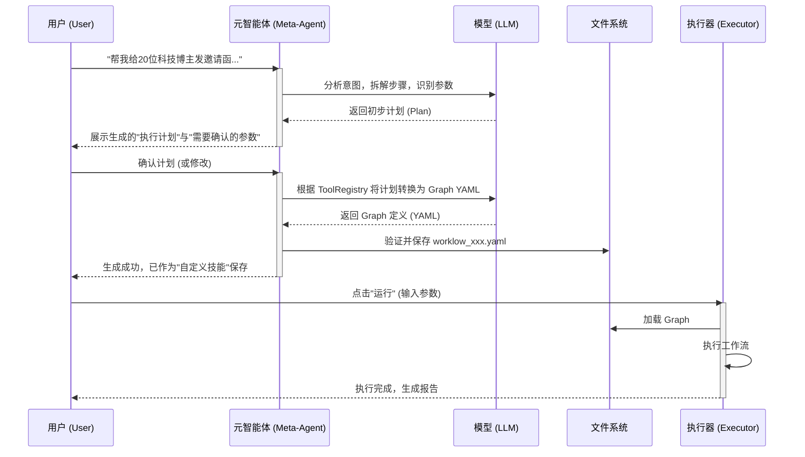

# 智能工作流生成器 (Meta-Agent) 设计方案

**版本**: v1.0
**日期**: 2025-12-29
**状态**: 草稿 (Draft)

## 1. 核心概念

**智能工作流生成器 (Workflow Generator)**，本质上是一个 "Meta-Agent"（元智能体）。
它的目标不是直接执行任务，而是**编写代码**——具体来说，是编写符合 `agent-core` 规范的 YAML 格式 Graph 定义文件。

用户不再需要学习复杂的 YAML 语法或编程，只需用自然语言描述需求，系统即可生成一个可复用、可分享、可视化的"技能"。

## 2. 交互流程设计



## 3. 架构设计

### 3.1 核心组件：`GraphGenerationAgent`

这是一个专门用于生成 Graph 的 Agent。它拥有以下特殊能力：
1.  **Tool & Agent RAG**: 不仅检索单一工具 (`search_tool`)，还能检索系统中已存在的其他 Agent (`search_agent`)。
    *   *例如*: 用户说"分析一下这个博主"，Meta-Agent 可以直接调用已存在的 `profile_analysis_agent`，而不是重写一遍分析逻辑。
2.  **Schema Awareness**: 深刻理解 `agent-core` 的 Graph YAML 语法结构。
3.  **Goal Decomposition**: 将用户的宏观目标拆解为子目标。
4.  **Hierarchical Planning**: 能够判断当前步骤是应该调用一个简单函数（Tool），还是委托给另一个复杂的专家智能体（Agent）。

### 3.2 提示词策略 (Prompt Strategy)

我们需要构建一个强大的 System Prompt，包含：
-   **角色**: 资深架构师。
-   **核心原则**:
    1.  **复用优先**: 如果已有一个 Agent 能完成部分任务，优先调用它（Subgraph），而不是重新编排工具。
    2.  **自主代理**: 对于复杂的非结构化交互，使用 `browser_use_agent`。
-   **输出规范**: 严格的 YAML 格式。支持 `node.agent` 字段引用子图。

### 3.3 参数自动提取 (Parameter Extraction)

Meta-Agent 需要区分"硬编码逻辑"和"动态参数"。

*   **例子**: "给20位博主发邀请"
    *   *Intent*: 寻找博主 -> 发送邀请
    *   *Hardcoded*: 领域="科技" (如果用户没说每次都变)
    *   *Input Parameter*: `limit` (默认20), `topic` (默认科技), `invitation_text` (默认模板)

Meta-Agent 应生成如下 `inputs` 定义：

```yaml
inputs:
  topic:
    type: string
    description: "博主领域"
    default: "软件测评"
  limit:
    type: integer
    description: "寻找数量"
    default: 20
  invitation_template:
    type: string
    description: "邀请函内容模板"
```

## 4. 详细案例分析：博主邀请工作流

针对用户需求："请帮我给所有软件测评领域的博主发一篇邀请函..."

### 4.1 生成的 Graph 结构预览

生成的 Graph (`invite-bloggers.yaml`) 可能包含以下节点：

1.  **SearchBloggers** (`tool: social_media_search`)
    *   *说明*: 获取博主列表。

2.  **DeepAnalysis** (**Call Agent: `profile_analysis_agent`**)
    *   *说明*: 这里的分析逻辑很复杂（包括爬取历史文章、分析风格、判断匹配度），正好系统里已经有一个专家 Agent 擅长做这个。
    *   *Mechanism*: 将此节点定义为 Subgraph 调用。
    *   *Input*: `profile_url`
    *   *Output*: `analysis_report`

3.  **BrowserAgent** (`tool: browser_use_agent`)
    *   *说明*: 根据分析结果发送个性化私信。

4.  **GenerateReport** (`tool: report_generator`)
    *   *说明*: 汇总报告。

### 4.2 YAML 定义示例 (Hierarchical & Autonomous)

```yaml
apiVersion: agent/v1
kind: Graph
metadata:
  name: blogger-outreach-hierarchical
  description: "使用专家Agent分析博主并发送邀请"
spec:
  inputs:
    topic:
      type: string
      default: "软件测评"
    search_count:
      type: integer
      default: 20
    invite_text:
      type: string

  state:
    bloggers:
      type: array
      default: []
    results:
      type: array
      default: []

  nodes:
    # 步骤1: 获取列表
    - name: search_node
      tool: social_media_search
      params:
        platform: "xiaohongshu"
        keyword: "${inputs.topic}"
        limit: "${inputs.search_count}"
      outputs:
        state.bloggers: "$.data.profiles"

    # 步骤2: 遍历处理 (Map)
    - name: process_bloggers
      tool: map
      params:
        items: "${state.bloggers}"
        concurrency: 1
        
        # 内部逻辑: 这是一个串行的 Chain
        # 1. 先调用 Agent 分析
        # 2. 再调用 Browser 发送
        
        # 为了在 YAML 里表达这种 Map 内部的复杂逻辑，
        # 我们通常会定义一个辅助的 sub-graph 或者使用 composed_tool
        # 这里展示简化的概念：Map 支持引用另一个 Graph
        
        agent: "single_blogger_processor" # 引用另一个 Graph
        # 传递给子 Agent 的参数
        agent_inputs:
          profile_url: "${item.profile_url}"
          base_invite_text: "${inputs.invite_text}"
            
      outputs:
        state.results: "$.results"

    - name: report_node
      tool: report_generator
      params:
        data: "${state.results}"
```

**被引用的子 Graph (`single_blogger_processor.yaml`)**:
```yaml
apiVersion: agent/v1
kind: Graph
metadata:
  name: single_blogger_processor
spec:
  inputs:
    profile_url:
      type: string
    base_invite_text:
      type: string

  nodes:
    # 子步骤 1: 调用深层分析 Agent
    - name: analysis_agent
      agent: "profile_analysis_expert" # 这是一个已存在的专家 Agent
      inputs:
        url: "${inputs.profile_url}"
      outputs:
        state.style: "$.style"
        state.topics: "$.topics"

    # 子步骤 2: LLM 基于分析生成个性化话术
    - name: gen_msg
      tool: llm_generate
      params:
        prompt: "基于博主风格 ${state.style}，修改邀请函: ${inputs.base_invite_text}"
      outputs:
        state.final_msg: "$.content"

    # 子步骤 3: 浏览器操作
    - name: browser_send
      tool: browser_use_agent
      params:
        url: "${inputs.profile_url}"
        goal: "Send DM: ${state.final_msg}"
```

## 5. 关键技术难点与解决方案

### 5.1 多层级编排 (Multi-Level Orchestration)
**核心**: 支持 Graph 嵌套 (Graph within Graph)。
**实现**: 
- `agent-core` 编译器需要支持 `node.agent` 字段。
- 当遇到 `agent` 节点时，自动加载对应的 YAML，将其编译为 LangGraph 的 `Subgraph` 节点。
- **状态隔离**: 子 Agent 拥有独立的 State 空间，通过 inputs/outputs 与父 Graph 交换数据。

### 5.2 循环引用检测
**问题**: Agent A 调用 Agent B，Agent B 又调用 Agent A。
**解决方案**: `GraphCompiler` 在加载时进行依赖图检查，发现闭环依赖直接报错。

### 5.2 效率与成本平衡
**问题**: 纯自主 Agent 操作 20 个人可能非常慢且消耗大量 Token。
**解决方案**:
- **Hybrid Mode (混合模式)**:
    - 列表页搜索、数据抓取等结构化任务，优先调用 API 包装的工具 (`social_media_search`).
    - 发私信、点赞评论等复杂交互任务，交给 `browser_use_agent`。
- **Learn Once (一次学习)**: (进阶特性)
    - 用户第一次运行时，Agent 自主探索并记录成功的 Selector 路径。
    - 第二次运行时，尝试复用路径变成"快速脚本"，失效后再回退到自主模式。

## 6. 开发计划

1.  **Phase 1: Meta-Agent Core**
    - 实现 `GraphGenerator` Prompt。
    - 集成 `ToolRegistry.rag_search()` 供 LLM 查询工具。

### 6.2 引入 `browser_use_agent`
    - 集成 `Agent Core` 的视觉能力。
    - 实现 `Computer Use` 接口 (Screenshot/Coordinate Click)。


3.  **Phase 3: UI 集成**
    - 在前端实现 "自然语言创建工作流" 的对话框。
    - 实现生成的 Graph 可视化预览与参数调整表单。
