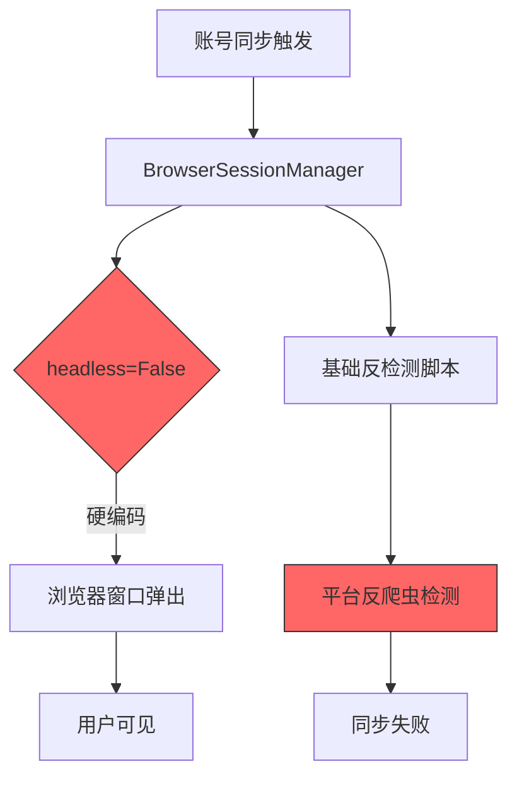
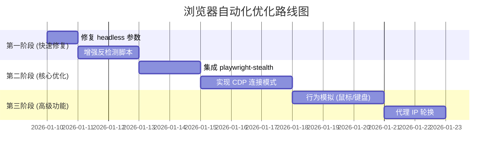

# 浏览器自动化实现评估报告

> 评估日期: 2026-01-10 | 目标: 解决账号同步弹窗问题与反爬虫检测

## 1. 当前实现分析

### 1.1 系统架构设计

根据 [01-系统架构.md](file:///Users/mac/saas/ai-creator/docs/01-系统架构.md) 的设计:

```yaml
发布策略: 官方API优先 → browser-use AI浏览器 → 半自动辅助
浏览器服务:
  - browser-use: AI Agent 直接操作虚拟浏览器（无需选择器/流程脚本）
  - Docker/K8s: 容器化部署 + 资源隔离
  - 浏览器池: 多实例管理 + 熔断降级
```

### 1.2 当前代码实现

#### 桌面端 Sidecar 浏览器工具

| 文件                                                                                                              | 功能                    | 问题                                          |
| ----------------------------------------------------------------------------------------------------------------- | ----------------------- | --------------------------------------------- |
| [browser.py](file:///Users/mac/saas/ai-creator/apps/sidecar/src/sidecar/tools/browser.py)                         | Playwright 基础发布工具 | `headless=False` 默认值会弹出浏览器           |
| [browser_use_publish.py](file:///Users/mac/saas/ai-creator/apps/sidecar/src/sidecar/tools/browser_use_publish.py) | browser-use AI 发布器   | 依赖 GPT-4o，无反检测配置                     |
| [manager.py](file:///Users/mac/saas/ai-creator/apps/sidecar/src/sidecar/browser/manager.py)                       | 浏览器会话管理          | 基础反检测脚本过于简单                        |
| [fingerprint.py](file:///Users/mac/saas/ai-creator/apps/sidecar/src/sidecar/browser/fingerprint.py)               | 指纹生成器              | 缺少高级指纹（Canvas、WebGL、AudioContext）   |
| [account_sync.py](file:///Users/mac/saas/ai-creator/apps/sidecar/src/sidecar/services/account_sync.py)            | 账号同步服务            | **`headless=False` 硬编码，直接导致弹窗问题** |

#### 关键问题代码

```python
# account_sync.py:46 - 账号同步服务强制使用非无头模式
browser_manager = BrowserSessionManager(headless=False)
```

```python
# manager.py:258-280 - 反检测脚本过于简单
async def _inject_stealth_scripts(self, context):
    await context.add_init_script("""
        // 隐藏 webdriver 属性
        Object.defineProperty(navigator, 'webdriver', {
            get: () => undefined
        });
        // ... 仅几行基础代码
    """)
```

### 1.3 问题总结



---

## 2. 反爬虫检测原理

### 2.1 主流平台检测手段

| 检测维度           | 检测内容                     | 当前实现状态                       |
| ------------------ | ---------------------------- | ---------------------------------- |
| **WebDriver 检测** | `navigator.webdriver` 属性   | ✅ 已隐藏                          |
| **自动化标记**     | Chrome 自动化标记            | ✅ 使用 `--disable-blink-features` |
| **浏览器指纹**     | Canvas、WebGL、AudioContext  | ❌ 未处理                          |
| **行为分析**       | 鼠标轨迹、打字速度、页面停留 | ❌ 未实现                          |
| **CDP 检测**       | DevTools 协议特征            | ❌ 未处理                          |
| **Headless 检测**  | 无头浏览器特征               | ⚠️ 部分处理                        |
| **IP/地理位置**    | 代理 IP 质量                 | ❌ 未配置                          |
| **Cookie/Session** | 登录态有效性                 | ✅ 已实现                          |

### 2.2 为何 Headless 模式被检测

```javascript
// 平台常用检测代码
const isHeadless = () => {
  // 1. Chrome 版本中的 HeadlessChrome 标记
  if (/HeadlessChrome/.test(navigator.userAgent)) return true;

  // 2. WebGL 渲染器
  const canvas = document.createElement("canvas");
  const gl = canvas.getContext("webgl");
  const renderer = gl.getParameter(gl.RENDERER);
  if (renderer.includes("SwiftShader")) return true;

  // 3. CDP 特征
  if (window.chrome && !window.chrome.app) return true;

  // 4. 插件数量
  if (navigator.plugins.length === 0) return true;

  return false;
};
```

---

## 3. 解决方案对比

### 3.1 方案对比表

| 方案                              | 静默运行 | 反检测能力 | 实现难度 | 成本 |  推荐指数  |
| --------------------------------- | :------: | :--------: | :------: | :--: | :--------: |
| **A: 增强 Playwright Stealth**    |    ✅    |   ⭐⭐⭐   |    低    | 免费 |   ⭐⭐⭐   |
| **B: 使用 Undetected Playwright** |    ✅    |  ⭐⭐⭐⭐  |    中    | 免费 |  ⭐⭐⭐⭐  |
| **C: CDP 连接用户真实浏览器**     |    ✅    | ⭐⭐⭐⭐⭐ |    中    | 免费 | ⭐⭐⭐⭐⭐ |
| **D: 商业反检测浏览器**           |    ✅    | ⭐⭐⭐⭐⭐ |    低    | 付费 |  ⭐⭐⭐⭐  |
| **E: 官方 API 优先**              |    ✅    |    N/A     |    高    | 免费 |   ⭐⭐⭐   |

---

## 4. 推荐方案详解

### 4.1 方案 C: CDP 连接用户真实浏览器 (首选推荐)

> [!TIP]
> 这是目前最可靠的反检测方案，MediaCrawler 项目已实现类似功能

#### 核心思路

```text
用户日常使用的 Chrome/Edge
       │
       │ 启动时附加 --remote-debugging-port=9222
       ▼
┌─────────────────┐
│  Chrome + CDP   │  ← 真实浏览器，有完整登录态、插件、历史
│  (后台运行)      │
└────────┬────────┘
         │ WebSocket (CDP协议)
         ▼
┌─────────────────┐
│  Playwright     │  ← 通过 CDP 连接，无需新启动浏览器
│  (控制端)       │
└─────────────────┘
```

#### 优势

1. **零检测风险**: 使用用户真实浏览器，拥有完整的浏览历史、插件、字体
2. **登录态复用**: 直接使用用户已登录的账号，无需重新登录
3. **用户无感知**: 浏览器可最小化或隐藏到托盘
4. **零额外成本**: 无需付费服务

#### 实现参考

项目中已有 [cdp_browser.py](file:///Users/mac/saas/ai-creator/external/BettaFish/MindSpider/DeepSentimentCrawling/MediaCrawler/tools/cdp_browser.py) 和 [browser_launcher.py](file:///Users/mac/saas/ai-creator/external/BettaFish/MindSpider/DeepSentimentCrawling/MediaCrawler/tools/browser_launcher.py) 可直接复用：

```python
# 核心代码示例
class CDPBrowserManager:
    async def launch_and_connect(self, playwright, headless=False):
        # 1. 检测用户安装的 Chrome/Edge
        browser_path = self._get_browser_path()

        # 2. 启动浏览器（可选最小化，无需 headless）
        args = [
            "--remote-debugging-port=9222",
            "--disable-blink-features=AutomationControlled",
            "--start-minimized",  # 🔥 最小化启动，用户无感知
        ]

        # 3. 通过 CDP 连接
        ws_url = await self._get_websocket_url(9222)
        self.browser = await playwright.chromium.connect_over_cdp(ws_url)
```

#### 用户无感知的关键配置

```python
# 启动浏览器时的参数
browser_args = [
    browser_path,
    f"--remote-debugging-port={debug_port}",
    "--no-first-run",
    "--no-default-browser-check",
    "--disable-blink-features=AutomationControlled",
    "--disable-infobars",
    # 🔥 关键：最小化启动
    "--start-minimized",
    # 或者使用无头新模式（Chrome 109+）
    # "--headless=new",
]
```

---

### 4.2 方案 B: Undetected Playwright (备选)

#### 使用 playwright-stealth 或 undetected-playwright

```bash
pip install playwright-stealth
# 或
pip install undetected-playwright
```

```python
from playwright.async_api import async_playwright
from playwright_stealth import stealth_async

async def create_stealth_browser():
    p = await async_playwright().start()
    browser = await p.chromium.launch(
        headless=True,  # 可以使用 headless 模式
        args=[
            "--disable-blink-features=AutomationControlled",
            "--disable-dev-shm-usage",
            "--no-sandbox",
        ]
    )
    context = await browser.new_context()
    page = await context.new_page()

    # 🔥 注入完整反检测脚本
    await stealth_async(page)

    return browser, page
```

#### playwright-stealth 特性

- 自动伪装 `navigator.webdriver`
- 模拟真实 Chrome 插件
- 处理 WebGL 指纹
- 模拟真实 Permissions API
- 处理 Chrome.app 检测

---

### 4.3 方案 A: 增强现有代码 (快速修复)

#### 修改 1: 账号同步服务支持静默模式

```diff
# apps/sidecar/src/sidecar/services/account_sync.py

class AccountSyncService:
-   async def sync_account(self, platform: str, account_id: str) -> SyncResult:
+   async def sync_account(
+       self,
+       platform: str,
+       account_id: str,
+       headless: bool = True,  # 默认静默模式
+   ) -> SyncResult:
        browser_manager = None
        try:
-           browser_manager = BrowserSessionManager(headless=False)
+           browser_manager = BrowserSessionManager(headless=headless)
```

#### 修改 2: 增强反检测脚本

```python
# apps/sidecar/src/sidecar/browser/manager.py

STEALTH_SCRIPT = """
// 完整反检测脚本
(function() {
    // 1. 隐藏 webdriver
    Object.defineProperty(navigator, 'webdriver', {
        get: () => undefined
    });

    // 2. 伪装 plugins
    Object.defineProperty(navigator, 'plugins', {
        get: () => {
            return [
                { name: 'Chrome PDF Plugin' },
                { name: 'Chrome PDF Viewer' },
                { name: 'Native Client' },
            ];
        }
    });

    // 3. 伪装 languages
    Object.defineProperty(navigator, 'languages', {
        get: () => ['zh-CN', 'zh', 'en']
    });

    // 4. 处理 permissions
    const originalQuery = window.navigator.permissions.query;
    window.navigator.permissions.query = (parameters) => (
        parameters.name === 'notifications' ?
            Promise.resolve({ state: Notification.permission }) :
            originalQuery(parameters)
    );

    // 5. 伪装 chrome 对象
    window.chrome = {
        runtime: {},
        loadTimes: function() {},
        csi: function() {},
        app: {}
    };

    // 6. 处理 WebGL 渲染器
    const getParameter = WebGLRenderingContext.prototype.getParameter;
    WebGLRenderingContext.prototype.getParameter = function(parameter) {
        if (parameter === 37445) return 'Intel Inc.';
        if (parameter === 37446) return 'Intel Iris OpenGL Engine';
        return getParameter.call(this, parameter);
    };

    // 7. 处理 headless 检测
    Object.defineProperty(navigator, 'platform', {
        get: () => 'MacIntel'
    });

    // 8. 隐藏自动化标记
    delete window.cdc_adoQpoasnfa76pfcZLmcfl_Array;
    delete window.cdc_adoQpoasnfa76pfcZLmcfl_Promise;
    delete window.cdc_adoQpoasnfa76pfcZLmcfl_Symbol;
})();
"""
```

---

## 5. 推荐实施路径

### 5.1 分阶段实施



### 5.2 立即可执行的修复

1. **修改 `headless` 参数**: 将 `account_sync.py` 中的 `headless=False` 改为 `headless=True`
2. **增强反检测脚本**: 使用上述完整的 stealth 脚本替换现有简单脚本
3. **安装 playwright-stealth**: `pip install playwright-stealth`

---

## 6. 额外建议

### 6.1 用户体验优化

| 场景     | 当前行为           | 优化建议                     |
| -------- | ------------------ | ---------------------------- |
| 账号同步 | 弹出浏览器窗口     | 后台静默执行，Toast 通知进度 |
| 首次登录 | 必须弹出浏览器扫码 | 弹出后自动最小化到托盘       |
| 作品发布 | 可能弹出浏览器     | 托盘图标显示发布进度         |

### 6.2 商业反检测浏览器参考 (方案 D)

如果以上方案仍无法满足需求，可考虑商业方案：

| 产品           | 特点                   | 价格      |
| -------------- | ---------------------- | --------- |
| **Multilogin** | 多账号隔离，专业级指纹 | $99+/月   |
| **GoLogin**    | 性价比高，API 支持好   | $49+/月   |
| **AdsPower**   | 国内团队，中文支持     | ¥180+/月  |
| **Nstbrowser** | 免费版可用，支持 API   | 免费/付费 |

### 6.3 安全考虑

> [!CAUTION]
> 请确保：
>
> - 不要在云端使用用户本地凭证进行自动化操作，除非用户明确授权
> - 遵守各平台的使用条款
> - 控制请求频率，避免对平台造成压力

---

## 7. 结论

| 问题           | 根因                    | 解决方案                                      |
| -------------- | ----------------------- | --------------------------------------------- |
| 浏览器窗口弹出 | `headless=False` 硬编码 | 改为 `headless=True` 或使用 CDP 最小化模式    |
| 反爬虫检测失败 | 反检测脚本过于简单      | 使用 playwright-stealth 或 CDP 连接真实浏览器 |

**最终推荐**: 采用 **方案 C (CDP 连接用户真实浏览器)** 作为主要方案，配合 **方案 A (增强反检测脚本)** 作为 fallback。

---

## 相关文档

- [系统架构](file:///Users/mac/saas/ai-creator/docs/01-系统架构.md)
- [MediaCrawler CDP 实现](file:///Users/mac/saas/ai-creator/external/BettaFish/MindSpider/DeepSentimentCrawling/MediaCrawler/tools/cdp_browser.py)
- [浏览器会话管理器](file:///Users/mac/saas/ai-creator/apps/sidecar/src/sidecar/browser/manager.py)
