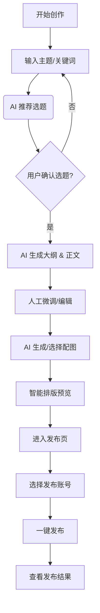

# 创流 (CreatorFlow) - MVP 需求规格说明书

> 基于 `docs/13-需求规格.md` 裁剪，聚焦核心业务闭环：创作 -> 账号 -> 发布。

## 1. MVP 目标与范围

**核心目标**：验证 "AI 辅助创作 + 一键多平台发布" 的核心价值，跑通从灵感到发布的完整流程。

**包含模块**：
1.  **项目管理**：项目是工作区上下文，所有内容、账号均归属于项目。
2.  **核心创作**：支持从选题到正文、配图、排版的完整生成流程。
3.  **账号管理**：支持主流平台账号的添加、状态监控与管理。
4.  **发布管理**：支持内容一键发布到已绑定的平台，并追踪发布状态。

---

## 2. 功能需求详情

### 2.1 AI 创作模块 (Article Creation)

实现完整的文章创作工作流，降低创作门槛。

| 需求ID | 功能名称 | 优先级 | MVP 需求描述 |
|:---|:---|:---|:---|
| **F-MVP-001** | **极简选题** | P0 | 用户输入关键词或领域，AI 推荐 5-10 个热门选题标题。 |
| **F-MVP-002** | **AI 智能写作** | P0 | 基于选定标题，一键生成完整文章内容。支持基础风格选择（如小红书风、公众号风）。 |
| **F-MVP-003** | **内容编辑** | P0 | 提供富文本编辑器，允许用户手动修改 AI 生成的内容（增删改）。 |
| **F-MVP-004** | **AI 配图生成** | P0 | 根据文章内容，AI 自动生成 1-3 张匹配的图片/封面图。 |
| **F-MVP-005** | **智能排版** | P1 | 提供基础排版功能（一键格式化），适配主流平台阅读体验。 |

### 2.2 平台账号管理 (Platform Account Management)

构建多平台分发的基础设施。

| 需求ID | 功能名称 | 优先级 | MVP 需求描述 |
|:---|:---|:---|:---|
| **F-MVP-010** | **账号添加** | P0 | 支持添加主流平台账号（优先支持：小红书、抖音、公众号）。支持 Cookie/扫码等方式登录。 |
| **F-MVP-011** | **账号列表** | P0 | 展示已绑定账号列表，显示头像、昵称、平台图标。 |
| **F-MVP-012** | **状态监控** | P0 | 实时检测账号登录状态（有效/失效），失效时提示重新登录。 |
| **F-MVP-013** | **账号删除** | P1 | 支持解绑/删除不再使用的平台账号。 |

### 2.3 多平台发布 (Publishing Flow)

实现跨平台的高效分发。

| 需求ID | 功能名称 | 优先级 | MVP 需求描述 |
|:---|:---|:---|:---|
| **F-MVP-020** | **发布配置** | P0 | 在发布页选择要发布的平台和账号（支持多选）。 |
| **F-MVP-021** | **一键发布** | P0 | 点击发布后，系统自动将内容分发至所有选定平台。 |
| **F-MVP-022** | **发布队列** | P1 | 展示正在进行的发布任务进度。 |
| **F-MVP-023** | **发布结果** | P0 | 反馈发布结果（成功/失败）。失败任务支持查看原因并重试。 |

### 2.4 项目管理 (Project Management)

项目是整个工作区的上下文，所有内容（素材、灵感、创作、作品、平台账号）均与项目关联。

| 需求ID | 功能名称 | 优先级 | MVP 需求描述 |
|:---|:---|:---|:---|
| **F-MVP-030** | **创建项目** | P0 | 用户可创建项目，设置项目名称和描述。 |
| **F-MVP-031** | **项目行业/领域设置** | P0 | 可选择行业（如科技、美妆、教育）和细分领域。 |
| **F-MVP-032** | **项目品牌设置** | P0 | 设置品牌名称、品牌调性、品牌关键词。 |
| **F-MVP-033** | **关注话题管理** | P0 | 添加/管理项目关注的话题和关键词。 |
| **F-MVP-034** | **账号标签管理** | P1 | 设置项目账号的定位标签（如美妆博主/科技测评）。 |
| **F-MVP-035** | **账号绑定项目** | P0 | 平台账号必须绑定到某个项目才能使用。 |
| **F-MVP-036** | **内容归属项目** | P0 | 创作的内容自动归属到当前选定项目。 |
| **F-MVP-037** | **项目切换** | P0 | 用户可在应用内快速切换当前工作项目（Header 下拉菜单）。 |
| **F-MVP-038** | **项目数据隔离** | P0 | 不同项目的内容、账号、数据相互隔离。 |

**项目作为创作上下文**:

- **选题推荐**: 根据项目关注话题推荐热点选题。
- **AI 创作**: 系统提示词自动注入项目品牌信息和账号定位。
- **发布**: 只能选择绑定到当前项目的账号发布。
- **数据分析**: 按项目维度汇总数据。

---

## 3. 业务流程图

### 3.1 完整创作与发布流程



### 3.2 账号添加流程

```mermaid
graph TD
    A[账号管理页] --> B[点击添加账号]
    B --> C[选择平台 (如小红书)]
    C --> D[弹出登录/扫码窗口]
    D --> E{登录成功?}
    E -- 否 --> D
    E -- 是 --> F[获取授权凭证/Cookie]
    F --> G[保存Encrypted凭证]
    G --> H[更新账号列表状态]
```

---

## 4. MVP 交付物清单

1.  **桌面端应用 (Electron/Tauri)**：集成创作编辑器与账号管理后台。
2.  **基础 AI 服务**：对接主流 LLM (如 GPT/Claude/DeepSeek) 的 API 接口。
3.  **浏览器自动化插件/服务**：用于模拟登录和发布（针对无官方 API 的平台）。
4.  **本地数据库**：存储草稿、账号凭证（加密）、发布记录。
