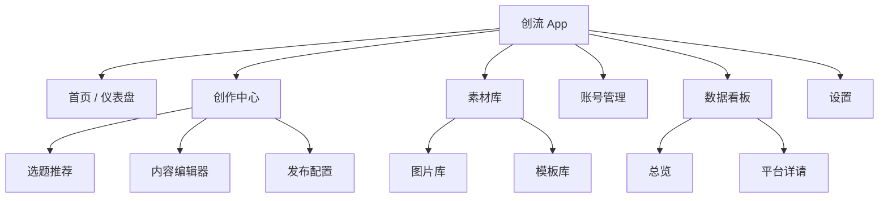

# 创流 (CreatorFlow) - UX 设计与线框图

> 基于 `docs/13-需求规格.md` 的 MVP 需求设计，重点关注创作效率与多平台发布体验。

## 1. 设计原则

*   **AI-First**: AI 不是附加功能，而是核心驱动力。界面应引导用户优先使用 AI 解决问题（如遇到空白页先推选题）。
*   **沉浸式创作**: 写作区域应尽量干扰最小化，AI 工具栏以侧边栏或悬浮球形式存在。
*   **一站式管理**: 让用户在应用内完成所有操作，无需频繁切换到浏览器或手机。
*   **即时反馈**: 所有耗时操作（如 AI 生成、发布）都必须有明确的进度反馈。

---

## 2. 信息架构 (IA)



---

## 3. 核心界面线框图

### 3.1 全局布局 (Global Layout)

采用经典的 "左侧导航 + 顶部状态 +通过内容区" 布局，适应桌面端操作。

```text
|  LOGO  |                        创作中心 > 编辑文章              [User] [-][x]|
+--------+-------------------------------------------------------+
|        |                                                       |
| [Home] |  [ 顶部工具栏: 保存 | 预览 | 导出 | 历史记录 ]          |
|        |                                                       |
| [创]   +---------------------------------------+---------------+
| (New)  |                                       |               |
|        |                                       |   AI 助手     |
| [素材] |             主要内容工作区             |    侧边栏      |
|        |             (Editor Area)             |               |
| [账号] |                                       | [ 扩写 ]      |
|        |                                       | [ 配图 ]      |
| [数据] |                                       | [ 润色 ]      |
|        |                                       |               |
| [设置] |                                       |               |
+--------+---------------------------------------+---------------+
| Status |  ✅ 账号状态正常   |   🚀 发布队列: 0/2 进行中          |
+--------+-------------------------------------------------------+
```

### 3.2 首页 / 仪表盘 (Dashboard)

**目标**: 让用户一眼看到"今天要干什么"以及"昨天做得怎么样"。

**布局**:
1.  **欢迎语**: "早安，[用户]。今天想创作点什么？"
2.  **快捷入口**: [新建文章] [查看热点] [账号状态]
3.  **数据概览卡片**: 昨日总阅读、新增粉丝、互动数 (带趋势箭头)。
4.  **近期草稿**: 列出最近修改的 3-5 篇文章。
5.  **平台状态栏**: 显示各平台账号连接状态（红/绿点）。

### 3.3 创作工作流 (Creation Flow)

这是核心高频场景，分为三个阶段：**选题 -> 写作 -> 发布**。

#### A. 极简选题 (Topic Selection)

用户刚点击"新建创作"时进入此页面。

```text
+-------------------------------------------------------+
|                                                       |
|                今天想写哪个领域的文章？                 |
|       [ 搜索框: 输入关键词，如"美妆", "AI工具" ] (Go)   |
|                                                       |
|  🔥 实时热点推荐:                                      |
|  1. [小红书] 2024年最火的口红每色...  (热度 98w) [+]   |
|  2. [科技] DeepSeek 深度评测...       (热度 85w) [+]   |
|                                                       |
|  💡 AI 建议选题:                                       |
|  - "适合夏天的5种清爽穿搭" [使用此题]                   |
|  - "新手如何入门自媒体？"   [使用此题]                   |
|                                                       |
+-------------------------------------------------------+
```

*   **交互**: 点击 `[+]` 或 `[使用此题]` 直接进入编辑器，并将标题填入。

#### B. 沉浸式编辑器 (Editor)

**左侧**: 大纲导航 (可折叠)。
**中间**: Markdown/富文本编辑区。
**右侧**: AI Copilot 工具栏。

```text
+---+-----------------------------------+---------------+
|大 |  标题: [ 适合夏天的5种清爽穿搭 ]     |  AI Copilot   |
|纲 |                                   |               |
|   |  (正文区域)                       | [聊天模式]     |
| 1 |  炎热的夏天来了...                 |               |
| . |                                   | > 帮我写一段开头|
| 引|  ![图片占位] [AI生成配图]          |               |
| 言|                                   | (AI): 好的，   |
|   |  ## 1. 浅色系搭配                  | "夏天是色彩的.. |
| 2 |  选择白色或淡蓝色的...             | [插入光标处]   |
| . |                                   |               |
|   |  (悬浮菜单: 选中文字后出现)        +---------------+
|   |  [ AI润色 | 扩写 | 缩写 | 改写 ]  | 样式工具       |
+---+-----------------------------------+ [ 小红书风 ]   |
|底栏: 字数: 520 | 预计阅读: 2min         | [ 公众号风 ]   |
+---------------------------------------+---------------+
```

*   **关键交互**:
    *   **选中优化**: 选中一段文字，弹出 AI 菜单（润色、改风格）。
    *   **一键配图**: 点击插入图片处的 "AI 生成"，右侧弹出图片生成面板，选定后插入。
    *   **风格转换**: 点击右侧 "样式工具" -> "小红书风"，全文自动增加 Emoji 和分段。

#### C. 发布配置 (Publish Settings)

写作完成后，点击右上角 `[去发布]` 进入此页。

```text
+-------------------------------------------------------+
|  < 返回编辑            发布设置             [一键发布] |
+-------------------------------------------------------+
|                                                       |
|  1. 选择平台 (已选 3 个)                               |
|  [x] (icon) 小红书 (账号: 美妆达人) [未登录!]          |
|  [x] (icon) 抖音   (账号: User123)                   |
|  [ ] (icon) 公众号                                    |
|                                                       |
|  2. 内容预览 & 适配                                    |
|  +-------------------+  +-------------------+         |
|  |   小红书预览       |  |    抖音预览       |         |
|  | [封面]            |  | [视频/图]         |         |
|  | 标题: ...         |  | 文案: ...         |         |
|  | 正文(自动缩减)...  |  | (自动提取Tag)...  |         |
|  | [编辑]            |  | [编辑]            |         |
|  +-------------------+  +-------------------+         |
|                                                       |
|  3. 发布时间                                           |
|  (o) 立即发布   ( ) 定时发布 [ 2025-01-05 10:00 ]     |
|                                                       |
+-------------------------------------------------------+
```

### 3.4 账号管理 (Account Management)

**列表视图**:

```text
+-------------------------------------------------------+
| 账号管理                        [+ 添加账号]           |
+-------------------------------------------------------+
|                                                       |
| 小红书                                                 |
| +----------------+  +----------------+                |
| | (Avatar)       |  | (Avatar)       |                |
| | 种草姬         |  | 待登录...       |                |
| | 🟢 状态正常     |  | 🔴 需要登录     |                |
| | [同步数据] [x] |  | [立即登录] [x]  |                |
| +----------------+  +----------------+                |
|                                                       |
| 抖音                                                   |
| +----------------+                                    |
| | ...            |                                    |
+-------------------------------------------------------+
```

**添加账号流程 (Modal)**:
1.  点击 `[+ 添加账号]`
2.  选择平台图标。
3.  **扫码登录**: 弹出内置浏览器窗口，自动跳转至平台登录页。
4.  用户在弹窗中完成扫码/验证。
5.  系统检测到登录成功，自动获取凭证，关闭弹窗，刷新列表。

---

## 4. 视觉规范概要

*   **主色调**: 品牌蓝 `#2563EB` (专业、信赖) + 活力紫 `#7C3AED` (AI、创造力)。
*   **背景**: 深色模式 (Dark Mode) 为主，适合沉浸式创作；提供浅色模式。
*   **字体**: 系统默认 (Inter / San Francisco / 苹方)，保证清晰易读。
*   **圆角**: 统一 `8px` 或 `12px`，显得现代柔和。
*   **动效**:
    *   AI 生成时使用流光/呼吸效果，减少等待焦虑。
    *   发布成功时显示 Checkmark 动画。

## 5. 交互细节说明

1.  **AI 响应等待**: 所有的 AI 操作（写作、配图）都必须是**流式输出 (Streaming)**，即字是一个个蹦出来的，图片是从模糊到清晰的，不能让用户干等。
2.  **错误处理**:
    *   发布失败时，不要只显示"失败"，要显示"Cookie 过期，请[重新登录]"。
    *   网络断开时，编辑器必须提示"已离线，内容保存在本地"。
3.  **撤销/重做**: 编辑器必须支持 `Cmd+Z` / `Cmd+Shift+Z`，包括撤销 AI 生成的内容。
