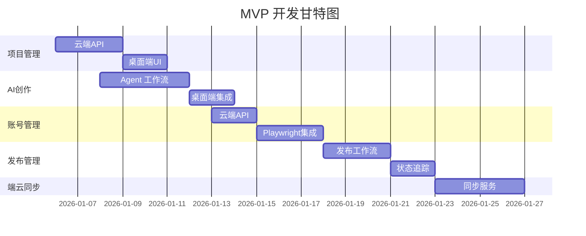

# MVP 开发计划 - 概览

> 基于 `docs/14-MVP需求规格.md` 编排完整开发任务
> 版本: v1.0 | 更新: 2026-01-05

## 一、开发目标

**核心目标**: 实现 "AI 辅助创作 + 一键多平台发布" 的 MVP 版本，跑通从灵感到发布的完整流程。

**技术约束**:
- 桌面端: Tauri 2.0 + React + Python Sidecar
- 云端: FastAPI (fastapi_best_architecture)
- Agent: LangGraph + agent-core 共享包
- 数据库: 桌面端 SQLite, 云端 PostgreSQL

## 二、模块拆分

| 序号 | 模块 | 文档 | 优先级 | 预估工期 |
|------|------|------|--------|----------|
| 01 | 项目管理 | [01_项目管理.md](./01_项目管理.md) | P0 | Week 1 |
| 02 | AI 创作 | [02_AI创作.md](./02_AI创作.md) | P0 | Week 1-2 |
| 03 | 账号管理 | [03_账号管理.md](./03_账号管理.md) | P0 | Week 2 |
| 04 | 发布管理 | [04_发布管理.md](./04_发布管理.md) | P0 | Week 2-3 |
| 05 | 端云同步 | [05_端云同步.md](./05_端云同步.md) | P1 | Week 3 |

## 三、整体架构

```text
┌─────────────────────────────────────────────────────────────────────────────┐
│                          桌面端 (Tauri 2.0)                                  │
│  ┌─────────────────────────────────────────────────────────────────────────┐│
│  │ 前端 UI (React)                                                          ││
│  │  ┌──────────┐ ┌──────────┐ ┌──────────┐ ┌──────────┐ ┌──────────┐       ││
│  │  │ 项目管理 │ │ 创作中心 │ │ 账号管理 │ │ 发布中心 │ │  设置    │       ││
│  │  └──────────┘ └──────────┘ └──────────┘ └──────────┘ └──────────┘       ││
│  └─────────────────────────────────┬───────────────────────────────────────┘│
│                                    │ IPC                                     │
│  ┌─────────────────────────────────┴───────────────────────────────────────┐│
│  │ Rust Core                                                                ││
│  │  ┌──────────┐ ┌──────────┐ ┌──────────┐ ┌──────────┐                    ││
│  │  │ SQLite   │ │ Sidecar  │ │ Keychain │ │ 系统API  │                    ││
│  │  └──────────┘ └────┬─────┘ └──────────┘ └──────────┘                    ││
│  └────────────────────┼────────────────────────────────────────────────────┘│
│                       │ JSON-RPC                                             │
│  ┌────────────────────┴────────────────────────────────────────────────────┐│
│  │ Python Sidecar (agent-core)                                              ││
│  │  ┌──────────┐ ┌──────────┐ ┌──────────┐ ┌──────────┐                    ││
│  │  │ AI Graph │ │Playwright│ │ BettaFish│ │ LLM API  │                    ││
│  │  └──────────┘ └──────────┘ └──────────┘ └──────────┘                    ││
│  └─────────────────────────────────────────────────────────────────────────┘│
└─────────────────────────────────────────────────────────────────────────────┘
                                    │ HTTPS
┌───────────────────────────────────┴─────────────────────────────────────────┐
│                          云端服务 (FastAPI)                                  │
│  ┌──────────┐ ┌──────────┐ ┌──────────┐ ┌──────────┐ ┌──────────┐          │
│  │ 用户服务 │ │ 项目服务 │ │ 账号服务 │ │ 发布服务 │ │ LLM 网关 │          │
│  └──────────┘ └──────────┘ └──────────┘ └──────────┘ └──────────┘          │
│  ┌─────────────────────────────────────────────────────────────────────────┐ │
│  │ 基础设施: PostgreSQL | Redis | MinIO                                     │ │
│  └─────────────────────────────────────────────────────────────────────────┘ │
└─────────────────────────────────────────────────────────────────────────────┘
```

## 四、开发顺序



## 五、验收标准

- [ ] **项目管理**: 创建/编辑/切换项目，项目数据隔离
- [ ] **AI 创作**: 选题推荐 → AI写作 → 配图 → 预览
- [ ] **账号管理**: 添加小红书/抖音账号，状态监控
- [ ] **发布管理**: 一键发布到多平台，发布状态追踪
- [ ] **端云同步**: 离线创作 + 联网同步
